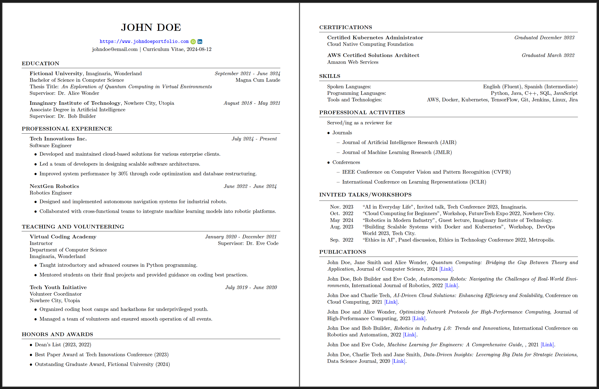

<!-- markdownlint-disable-next-line -->
<div align="center">

  <!-- markdownlint-disable-next-line -->

# CV Tools

A tool to automate the creation of professional LaTeX-based CVs.




</div>

CV Tools is a project designed to streamline the creation of professional CVs using LaTeX. This tool provides templates and configuration files to easily generate a CV with customizable sections for education, work experience, publications, and much more.

Feel free to edit and use this tool according to your needs. Customize the LaTeX templates and configuration files to fit your personal requirements and preferences.

# Features

- **Customizable LaTeX Templates**: Pre-defined LaTeX templates for creating professional CVs.
- **Flexible Configuration**: Easy-to-edit configuration files to personalize your CV.
- **BibTeX Support**: Automatically generate a formatted list of publications from a BibTeX file.
- **Automated Build Process**: Scripted build process to generate the final PDF CV.

# Build Status

| Ubuntu                                                                                     | macOS                                                                                    |
| ------------------------------------------------------------------------------------------ | ---------------------------------------------------------------------------------------- |
|  |  |

# Table of Contents

- [Getting Started](#getting-started)
  - [Installation](#installation)
  - [Usage](#usage)
- [YAML Configuration](#yaml-configuration)
- [BibTeX Configuration](#bibtex-configuration)
- [Contributing](#contributing)

# Getting Started

Below are two installation methods to set up and use CV Tools on your local machine. The Docker-based setup is recommended for a hassle-free experience, but you can also set up manually from the source if you prefer.

## Installation

### Method 1: Using Docker (Recommended)

Using docker allows you to run the tool in a consistent environment without worrying about dependencies on your local machine.

#### Prerequisites

- **Docker**: Ensure you have Docker installed on your machine. You can download and install Docker from [here](https://docs.docker.com/engine/install/).

#### Steps

Clone the Repository:

```bash
$ git clone https://github.com/mlsdpk/cv-tools.git
$ cd cv-tools
```

Build the Docker image using the provided `Dockerfile`.

```bash
$ docker build -t cv-tools .
```

Start a Docker container with the image you just built. This will launch an interactive shell with the virtual environment activated and mount the current cv-tools directory.

```bash
$ docker run --rm -it -v $(pwd):/workdir cv-tools
```

The `-v $(pwd):/workdir` option mounts your local cv-tools directory to the `/workdir` directory inside the container.

### Method 2: From Source with Manual Installation

If you prefer to set up the environment manually on your local machine, follow the steps below.

#### Prerequisites

- **LaTeX Distribution**: Ensure you have a LaTeX distribution installed. For instance, [TeX Live](https://www.tug.org/texlive/) (recommended) or [MikTeX](https://miktex.org/).
- **Python**: Python 3.x is required for running the build scripts.

#### Installing Dependencies

Depending on your installed LaTeX distribution, you may need to ensure that all the required LaTeX packages are installed. A list of these necessary packages can be found in the `packages.list` file.

You can use the tlmgr command to install the packages as follows:

```bash
$ tlmgr install <package1> <package2> ...
```

To manage your Python dependencies, it's recommended to use a virtual environment:

```bash
$ python3 -m venv cv-tools
$ source cv-tools/bin/activate
```

Install the required Python packages using requirements.txt:

```bash
$ pip install -r requirements.txt
```

Clone the Repository:

```bash
$ git clone https://github.com/mlsdpk/cv-tools.git
$ cd cv-tools
```

## Usage

To generate a CV, you can use the provided shell script, which offers flexibility through various command-line options.

## Default CV Generation

Running the script without any options will generate the CV using the default configuration (`cv.yaml`) and publication data (`publications.bib`) located in the `config` directory.

```bash
$ ./run.sh
```

This command will also check and install all necessary dependencies before generating a `.tex` file and a PDF file, both of which will be saved in the `output` directory.

## Customize the CV Generation

You can customize the CV generation by specifying different configuration and publication files, as well as changing the output file location.

- **Specify a different YAML configuration file:**
  ```bash
  $ ./run.sh -c path/to/custom_config.yaml
  ```
- **Use a different BibTeX file for publications:**
  ```bash
  $ ./run.sh -b path/to/custom_publications.bib
  ```
- **Change the output file location:**
  ```bash
  $ ./run.sh -o path/to/output/custom_cv.tex
  ```

These options can be combined together as well to suit your needs.

You can customize the content of your CV by editing the YAML configuration file. By default, this is the `cv.yaml` file located in the `config` directory, but you can specify a different YAML file from any location. This file allows you to define your personal details, education, work experience, skills, and more. You can add or remove sections, modify the fields, and tailor the CV content to your specific needs. The supported section types include `education`, `experience`, `skills`, `bullets`, `talks`, and `publications`. For more information, refer to [YAML Configuration](#yaml-configuration) section.

This tool also supports to automatically list your publications based on BibTeX entries provided in a specified BibTeX file. By default, this is the `publications.bib` file located in the `config` directory, but you can use a different BibTeX file from any location. Refer to [BibTeX Configuration](#bibtex-configuration) section for more details on configuring BibTeX entries.

## Skipping Dependency Checks and Installations

If you already have all dependencies installed and want to skip the automatic checking and installation process, use the `--no-deps` option:

```bash
$ ./run.sh --no-deps
```

This option is useful for speeding up subsequent runs when you know that all dependencies are already satisfied.

# YAML Configuration

The YAML configuration file allows you to customize various aspects of your CV. This section provides detailed instructions on configuring each parameter, including the `heading`, `subheading`, and `sections` fields. Each parameter controls different parts of the CV layout and content.

## Heading

The `heading` parameter sets the main title of the CV.
| Field | Type | Description | Required |
|-------|------|-------------|-----------|
| `name` | string | The name of the author, displayed as the main heading. | Yes |

Example:

```yaml
heading:
  name: "John Doe"  # The name of the CV author
```

## Subheading

The `subheading` parameter allows you to add supplementary details below the main heading. This includes personal links and social media profiles, which are displayed on one or two lines depending on the configuration.

### Links

The `links` type includes personal URLs or contact details. They can be highlighted and placed either on the first or second line.

| Field        | Type    | Description                                                                        | Required |
| ------------ | ------- | ---------------------------------------------------------------------------------- | -------- |
| `type`       | string  | Type of the subheading content; set to `links` for URLs or contact details.        | No       |
| `content`    | array   | List of link objects. Each object includes: `name`, `highlight`, and `show_below`. | No       |
| `name`       | string  | The URL or contact detail.                                                         | No       |
| `highlight`  | boolean | Whether or not the link should be highlighted and clickable.                       | No       |
| `show_below` | boolean | Determines if the link should be on the first line (false) or second line (true).  | No       |

Example:

```yaml
subheading:
  - type: links
    content:
      - name: "https://www.johndoeportfolio.com"
        highlight: true
        show_below: false
      - name: "johndoe@email.com"
        highlight: false
        show_below: true
```

### Socials

The `socials` type includes links to social media profiles and are rendered as icons. Supported types are:
- `orcid_id`
- `linkedin`
- `github`
- `twitter`

| Field        | Type    | Description                                                                              | Required |
| ------------ | ------- | ---------------------------------------------------------------------------------------- | -------- |
| `type`       | string  | Type of the subheading content; set to socials for social media profiles.                | No       |
| `content`    | array   | List of social objects. Each object includes: `type`, `url`, and `show_below`.           | No       |
| `type`       | string  | Type of social link (`orcid_id`, `linkedin`, `github` or `twitter`).                     | No       |
| `url`        | string  | The URL or ID of the social profile.                                                     | No       |
| `show_below` | boolean | Determines if the social link should be on the first line (false) or second line (true). | No       |

Example:

```yaml
subheading:
  - type: socials
    content:
      - type: orcid_id
        url: "0000-0000-0000-0000"
        show_below: false
      - type: linkedin
        url: "https://linkedin.com/in/johndoe"
        show_below: false
```

## Sections

The `sections` parameter allows you to define different sections of your CV, each designed to represent a specific kind of information. Below is a table summarizing the supported section types:

| Key            | Description                                             |
| -------------- | ------------------------------------------------------- |
| `education`    | Lists academic qualifications and related details.      |
| `experience`   | Details professional experiences.                       |
| `bullets`      | Provides a list of items and optional subitems.         |
| `skills`       | Lists skills, languages, tools, and technologies.       |
| `talks`        | Lists talks, workshops, and lectures given.             |
| `publications` | Lists research papers, articles, or other publications. |
| `newpage`      | Inserts a new page in the CV.                           |

Each section type has specific fields and formatting rules. Below are detailed descriptions and example YAML configurations for each section type.

### 1. Education

The `education` section is used to list your academic qualifications. It typically includes details like the university name, location, dates, degree, honors, thesis title, and supervisor.

| Field          | Type   | Description                                     | Required |
| -------------- | ------ | ----------------------------------------------- | -------- |
| `university`   | string | The name of the university or institution.      | Yes      |
| `location`     | string | The location of the university or institution.  | Yes      |
| `dates`        | string | The period during which the degree was pursued. | Yes      |
| `degree`       | string | The name of the degree obtained.                | Yes      |
| `honors`       | string | Honors received, if any.                        | No       |
| `thesis_title` | string | Title of the thesis, if applicable.             | No       |
| `supervisor`   | string | Name of the supervisor, if applicable.          | No       |

Example:

```yaml
sections:
  - type: education
    content:
      - university: "Fictional University"
        location: "Imaginaria, Wonderland"
        dates: "September 2021 - June 2024"
        degree: "Bachelor of Science in Computer Science"
        honors: "Magna Cum Laude"
        thesis_title: "An Exploration of Quantum Computing in Virtual Environments"
        supervisor: "Dr. Alice Wonder"
      - university: "Imaginary Institute of Technology"
        location: "Nowhere City, Utopia"
        dates: "August 2018 - May 2021"
        degree: "Associate Degree in Artificial Intelligence"
        supervisor: "Dr. Bob Builder"
```

### 2. Experience

The `experience` section is used to detail your professional experiences and releated details.

| Key       | Type   | Description                 | Required |
| --------- | ------ | --------------------------- | -------- |
| `type`    | string | Must be `experience`.       | Yes      |
| `content` | list   | List of experience entries. | Yes      |

**Experience Entry**

| Key      | Type   | Description                                                                                         | Required |
| -------- | ------ | --------------------------------------------------------------------------------------------------- | -------- |
| `name`   | string | Title of the experience section.                                                                    | Yes      |
| `entity` | list   | List of experience entities. This is used to group relevant experiences together under one section. | Yes      |

**Experience Entity**

| Key                | Type   | Description                               | Required |
| ------------------ | ------ | ----------------------------------------- | -------- |
| `organization`     | string | Name of the organization or company.      | Yes      |
| `dates`            | string | Duration of employment or involvement.    | Yes      |
| `position`         | string | Position or role held.                    | Yes      |
| `responsibilities` | list   | List of responsibilities or achievements. | No       |
| `supervisor`       | string | Supervisor's name (optional).             | No       |
| `department`       | string | Department name (optional).               | No       |
| `location`         | string | Location of the organization (optional).  | No       |

Example:

```yaml
- type: experience
  content:
    - name: "Professional Experience"
      entity:
        - organization: "Tech Innovations Inc."
          dates: "July 2024 - Present"
          position: "Software Engineer"
          responsibilities:
            - "Developed and maintained cloud-based solutions for various enterprise clients."
            - "Led a team of developers in designing scalable software architectures."
            - "Improved system performance by 30% through code optimization and database restructuring."
        - organization: "NextGen Robotics"
          dates: "June 2022 - June 2024"
          position: "Robotics Engineer"
          responsibilities:
            - "Designed and implemented autonomous navigation systems for industrial robots."
            - "Collaborated with cross-functional teams to integrate machine learning models into robotic platforms."
```

### 3. Bullets

| Key           | Description                                  |
| ------------- | -------------------------------------------- |
| `type`        | Must be `bullets`.                           |
| `title`       | Title of the bullet section.                 |
| `description` | Description or introductory text (optional). |
| `content`     | List of bullet points.                       |

**Bullet Item**

| Key        | Description                                               |
| ---------- | --------------------------------------------------------- |
| `item`     | Main bullet point text.                                   |
| `subitems` | List of sub-bullet points under the main item (optional). |

Example:

```yaml
- type: bullets
  title: "Honors and Awards"
  description: ""
  content:
    - item: "Dean's List (2023, 2022)"
    - item: "Best Paper Award at Tech Innovations Conference (2023)"
    - item: "Outstanding Graduate Award, Fictional University (2024)"

- type: bullets
  title: "Professional Activities"
  description: "Served/ing as a reviewer for"
  content:
    - item: "Journals"
      subitems:
        - "Journal of Artificial Intelligence Research (JAIR)"
        - "Journal of Machine Learning Research (JMLR)"
    - item: "Conferences"
      subitems:
        - "IEEE Conference on Computer Vision and Pattern Recognition (CVPR)"
        - "International Conference on Learning Representations (ICLR)"
```

### 4. Skills

| Key       | Description       |
| --------- | ----------------- |
| `type`    | Must be `skills`. |
| `content` | List of skills.   |

**Skills Entry**

| Key    | Description                     |
| ------ | ------------------------------- |
| `name` | Title of the skills category.   |
| `data` | List of skills or technologies. |

Example:

```yaml
- type: skills
  content:
    - name: "Spoken Languages"
      data: "English (Fluent), Spanish (Intermediate)"
    - name: "Programming Languages"
      data: "Python, Java, C++, SQL, JavaScript"
    - name: "Tools and Technologies"
      data: "AWS, Docker, Kubernetes, TensorFlow, Git, Jenkins, Linux, Jira"
```

### 5. Talks

| Key       | Description                     |
| --------- | ------------------------------- |
| `type`    | Must be `talks`.                |
| `content` | List of talks or presentations. |

**Talk Entry**

| Key     | Description                                                  |
| ------- | ------------------------------------------------------------ |
| `name`  | Title of the talk, type, conference or event name, location. |
| `month` | Month of the talk.                                           |
| `year`  | Year of the talk.                                            |

Example:

```yaml
- type: talks
  content:
    - name: "``AI in Everyday Life'', Invited talk, Tech Conference 2023, Imaginaria."
      month: "Nov."
      year: "2023"
    - name: "``Cloud Computing for Beginners'', Workshop, FutureTech Expo 2022, Nowhere City."
      month: "Oct."
      year: "2022"
    - name: "``Robotics in Modern Industry'', Guest lecture, Imaginary Institute of Technology."
      month: "May"
      year: "2021"
    - name: "``Building Scalable Systems with Docker and Kubernetes'', Workshop, DevOps World 2023, Tech City."
      month: "Aug."
      year: "2023"
    - name: "``Ethics in AI'', Panel discussion, Ethics in Technology Conference 2022, Metropolis."
      month: "Sep."
      year: "2022"
```

### 6. Publications

The `publications` section type is designed to list all relevant research articles, papers, and academic publications. This section automatically pulls data from a user-specified BibTeX file to render the publications in your CV. For more information on how to configure and link your BibTeX file, refer to the [BibTeX Configuration Section](#bibtex-configuration).

| Key    | Type   | Description                                                                           | Required |
| ------ | ------ | ------------------------------------------------------------------------------------- | -------- |
| `type` | string | Must be `publications`. Specifies that the section will render academic publications. | Yes      |

Example:

```yaml
sections:
  - type: publications
```

### 7. New Page

The `newpage` section type is used to force the current page to end and start a new one. This can be useful when you want to ensure that certain sections or content start on a fresh page, particularly in situations where visual organization is important.

| Key    | Type   | Description                                                             | Required |
| ------ | ------ | ----------------------------------------------------------------------- | -------- |
| `type` | string | Must be `newpage`. Forces the current page to end and starts a new one. | Yes      |

Example:

```yaml
sections:
  - type: newpage
```

An example of a complete YAML configuration can be found [here](config/cv.yaml).

## Using Special Characters

When configuring your YAML files, you might want to include special formatting within strings, such as bold text, hyperlinks, line breaks, and horizontal spacing. These special characters and formatting options will be automatically converted into the appropriate LaTeX commands during the rendering process. Here's how to use them:

### Supported Characters

- **Bold Text:**  
  To make text bold, wrap the text with `**` (e.g., `"**Bold Text**"`).

- **Italics:**  
  To italicize text, wrap the text with `*` (e.g., `"*Italic Text*"`).

- **Hyperlinks:**  
  To create a hyperlink, use the Markdown link syntax `[text](url)` (e.g., `"[My Portfolio](https://myportfolio.com)"`).

- **Line Breaks:**  
  To insert a line break, use the newline character `\n` (e.g., `"First Line\nSecond Line"`).

- **Horizontal Spacing:**
  - To add a small space, use two spaces (e.g., `"Text  2 spaces later"`).
  - To add an "em" space, use four spaces or a tab (e.g., `"Text    4 spaces later"` or `"Text\twith a tab"`).

Here’s an example YAML configuration that utilizes these special characters:

```yaml
heading:
  name: "John Doe" # mandatory

sections:
  - type: education
    content:
      - university: "Fictional University"
        location: "Imaginaria, Wonderland"
        dates: "September 2021 - June 2024"
        degree: "Bachelor of Science in *Computer Science*"
        honors: "**Magna Cum Laude**"
        thesis_title: "An Exploration of **Quantum Computing** in Virtual Environments"
        supervisor: "Dr. Alice Wonder"
```

# BibTeX Configuration

Managing your publications is straightforward with a BibTeX file. The BibTeX file allows you to maintain a structured list of your publications, which can be automatically formatted and included in your CV.

## Steps to Configure BibTeX:

1. **Specify Your BibTeX File:** By default, the tool uses a `publications.bib` file located in the `config` directory. However, you can specify a different BibTeX file from any location when running the script.
2. **Add BibTeX Entries:** Ensure your BibTeX file contains the entries for your publications. The tool will automatically format these entries and include them in your CV.
3. **Add `publications` section:** Include the section type called `publications` inside your YAML configuration file.

**Example BibTeX Entry:**

```bibtex
@article{doe2024quantum,
  author = {John Doe and Jane Smith and Alice Wonder},
  title = {Quantum Computing: Bridging the Gap Between Theory and Application},
  journal = {Journal of Computer Science},
  year = {2024},
  url = {https://example.com/quantum-computing-paper}
}
```

Your publications will be included in the CV in the order they appear in the .bib file. An example BibTeX data file is provided [here](config/publications.bib).

# Contributing

Feel free to contribute to this project by submitting issues or pull requests. Contributions are welcome to improve the templates, add new features, or fix bugs.

# Acknowledgments

The LaTeX template currently supported in this project is based on the **Medium Length Professional CV** template from [LaTeXTemplates.com](https://www.latextemplates.com/template/medium-length-professional-cv), which has been extensively modified for this project. The original template was created by [Trey Hunner](https://treyhunner.com).

# License

This project is licensed under the [MIT License](https://opensource.org/license/mit).
